# GNU Emacs Backend — Approximate Header-Coupling Map

**Date**: 2026-03-28
**Source**: Derived from `#include` analysis of GNU Emacs `src/` C-family
files, bucketed into coarse subsystems for audit planning.

## Legend

`A → B [files]` means files in subsystem A include headers from subsystem B.

This document is useful for finding coupling hot spots, but it is not a proof
of semantic dependency order:

- `#include` edges show header-level coupling, not call flow, init order, or
  behavioral ownership.
- The subsystem buckets here are heuristic. GNU Emacs does not define these as
  formal architectural layers.
- The "layers" below are therefore an audit aid, not a strict DAG.
- Objective-C backend files and some generated/platform-specific glue are
  summarized more loosely than the core C files, so "full" would overstate what
  this map proves.

---

## Layer 0: Foundation (no subsystem deps below)

```
Lisp Core  (alloc.c, data.c, eval.c, fns.c, bytecode.c, floatfns.c, bignum.c,
            sort.c, gmalloc.c, ralloc.c, vm-limit.c)
  → Buffer                [alloc.c, bytecode.c, data.c, eval.c, fns.c]
  → Command               [alloc.c, data.c, eval.c]
  → Display               [alloc.c, eval.c]
  → Font                  [alloc.c]
  → Frame                 [alloc.c, data.c]
  → I18n                  [alloc.c, data.c, fns.c]
  → Process               [data.c]
  → Terminal              [alloc.c]
  → Timer                 [alloc.c, eval.c]
  → TreeSitter            [alloc.c, fns.c]
  → Window                [alloc.c, bytecode.c, fns.c]
  → GnuTLS                [fns.c]
  → DOS Backend           [alloc.c, vm-limit.c]
  → W32 Backend           [alloc.c, vm-limit.c]
```

> **Note**: Lisp Core has *upward* dependencies into almost everything because
> `lisp.h` types and macros are everywhere, and alloc.c needs to walk all live
> objects (buffers, windows, frames, etc.) for GC. These are **fundamental
> coupling**, not cleanly separable in GNU Emacs's design.

---

## Layer 1: Text Foundation

```
Buffer  (buffer.c, insdel.c, marker.c, itree.c, region-cache.c)
  → Lisp Core             [all]
  → Window                [buffer.c, insdel.c, marker.c, textprop.c]
  → I18n                  [buffer.c, insdel.c, marker.c]
  → Editing               [buffer.c]
  → Command               [buffer.c, intervals.c]
  → Frame                 [buffer.c]
  → Process               [buffer.c]
  → Timer                 [buffer.c]
  → TreeSitter            [buffer.c, insdel.c]
  → Image                 [buffer.c]
  → W32 Backend           [buffer.c]

Buffer/TextProps  (intervals.c, textprop.c)
  → Lisp Core, Buffer, Window, Keymap

I18n  (character.c, charset.c, chartab.c, coding.c, ccl.c,
       composite.c, bidi.c, category.c, casetab.c, casefiddle.c)
  → Lisp Core             [all]
  → Buffer                [bidi.c, casefiddle.c, casetab.c, category.c,
                           character.c, charset.c, coding.c, composite.c]
  → Display               [bidi.c, character.c, composite.c]
  → Frame                 [character.c, composite.c]
  → Command               [casefiddle.c, ccl.c]
  → Search                [casefiddle.c]
  → Terminal              [coding.c, composite.c]
  → TreeSitter            [casefiddle.c]

Search  (search.c, regex-emacs.c, syntax.c)
  → Lisp Core, Buffer, Display, I18n
```

---

## Layer 2: Editing & I/O

```
Editing  (editfns.c, cmds.c, undo.c)
  → Lisp Core, Buffer, Window
  → Command               [cmds.c, undo.c]
  → Display               [indent.c]
  → Frame                 [cmds.c, indent.c]
  → I18n                  [cmds.c, editfns.c, indent.c]
  → Search                [cmds.c]
  → Timer                 [editfns.c]
  → TreeSitter            [editfns.c]
  → Android Backend       [editfns.c]

Indent  (indent.c)
  → Lisp Core, Buffer, Character, Category, Composite, Frame, Window,
    Display, Intervals

File I/O  (fileio.c, dired.c, filelock.c)
  → Lisp Core, Buffer, I18n, Window
  → Command               [fileio.c]
  → Frame                 [fileio.c]
  → Timer                 [dired.c, fileio.c]
  → Android Backend       [dired.c, fileio.c, filelock.c]
  → DOS Backend           [dired.c, fileio.c]
  → W32 Backend           [fileio.c, filelock.c]

Read/Print  (lread.c, print.c, doprnt.c, doc.c)
  → Lisp Core, Buffer, I18n, Display
  → Command               [doc.c, lread.c]
  → Frame                 [print.c]
  → Process               [print.c]
  → Terminal              [lread.c]
  → Timer                 [lread.c]
  → Image                 [print.c]
  → TreeSitter            [print.c]
  → Android Backend       [doc.c, lread.c]
  → DOS Backend           [lread.c]
  → NS Backend            [lread.c]
```

---

## Layer 3: Windowing Model

```
Window  (window.c)
  → Lisp Core, Buffer, Frame, Display
  → Command               [window.c]
  → Editing               [window.c]
  → Terminal              [window.c]
  → Image                 [window.c]
  → DOS Backend           [window.c]

Frame  (frame.c)
  → Lisp Core, Buffer, Window, Display, Terminal
  → Command               [frame.c]
  → Font                  [frame.c]
  → DOS Backend           [frame.c]
  → X Widget              [frame.c]

Terminal  (terminal.c)
  → Lisp Core, Display, Frame, I18n, Command

Font  (font.c, fontset.c, ftfont.c, ftcrfont.c, hbfont.c,
       xfont.c, xftfont.c, sfnt.c, sfntfont.c, sfntfont-android.c)
  → Lisp Core, Frame, Display, I18n
  → Buffer                [font.c, hbfont.c]
  → Window                [font.c]
  → Terminal              [font.c]
  → X Backend             [ftcrfont.c, xfont.c, xftfont.c]
  → PGTK Backend          [ftcrfont.c]
  → Haiku Backend         [ftcrfont.c]
  → W32 Backend           [hbfont.c]
  → Android Backend       [sfntfont-android.c]
```

---

## Layer 4: Display Engine

```
Display  (xdisp.c, dispnew.c, scroll.c, fringe.c)
  → Lisp Core             [all]
  → Buffer                [dispnew.c, fringe.c, term.c, xdisp.c, xfaces.c]
  → Window                [dispnew.c, fringe.c, term.c, xdisp.c, xfaces.c]
  → Frame                 [cm.c, dispnew.c, fringe.c, scroll.c, term.c,
                           xdisp.c, xfaces.c]
  → Terminal              [dispnew.c, fringe.c, scroll.c, term.c, xdisp.c]
  → I18n                  [term.c, xdisp.c, xfaces.c]
  → Command               [dispnew.c, term.c, xdisp.c]
  → Font                  [xdisp.c, xfaces.c]
  → Timer                 [dispnew.c, xdisp.c]
  → Editing               [xdisp.c]
  → Image                 [dispnew.c, xdisp.c]
  → Android Backend       [dispnew.c]
  → DOS Backend           [term.c, termcap.c, xfaces.c]
  → W32 Backend           [dispnew.c, term.c]

Faces  (xfaces.c)
  → Lisp Core, Frame, Buffer, Display, Window, Font, I18n

TTY Display  (cm.c, term.c, termcap.c, terminfo.c, tparam.c)
  → Lisp Core, Frame, Display
```

---

## Layer 5: Command System

```
Command / Keyboard  (keyboard.c, keymap.c, cmds.c, macros.c,
                     callint.c, menu.c, minibuf.c, textconv.c)

  keyboard.c:
    → Lisp Core, Buffer, Window, Frame, Display, I18n, Command,
      Terminal, Timer, Process, Search, Menu
    → Android Backend, DOS Backend, W32 Backend

  keymap.c:
    → Lisp Core, Buffer, Keyboard, Window, Command, Terminal

  menu.c:
    → Lisp Core, Display, Keyboard, Keymap, Frame, Window,
      Terminal, Buffer

  minibuf.c:
    → Lisp Core, Buffer, Keyboard, Frame, Window, Keymap, W32 Backend
```

---

## Layer 6: Process & Threading

```
Process  (process.c, callproc.c)
  → Lisp Core, Buffer, I18n, Window, Frame
  → Command               [callproc.c, process.c]
  → Timer                 [process.c]
  → Display               [process.c]
  → GnuTLS                [process.c]
  → Android Backend       [callproc.c, process.c]
  → DOS Backend           [callproc.c]
  → NS Backend            [callproc.c]
  → PGTK Backend          [callproc.c]
  → W32 Backend           [callproc.c]
  → X Backend             [process.c]

Thread  (thread.c, systhread.c, emacs-module.c)
  → Lisp Core, Buffer, Command, I18n, Process
  → NS Backend            [systhread.c, thread.c]
  → W32 Backend           [emacs-module.c, systhread.c]

Timer  (atimer.c, timefns.c)
  → Lisp Core, Command, I18n, DOS Backend
```

---

## Layer 7: Platform Backends (many center on `termhooks.h`)

Many backends have a broadly similar dependency shape: they depend on the core
windowing model (Frame, Window, Terminal) plus Display, Font, I18n, and
Command. But the details differ, and some backends reuse other backend code.
So this section should be read as a family resemblance map, not a proof of
perfect interchangeability.

```
X Backend  (xterm.c, xfns.c, xmenu.c, xselect.c, xrdb.c,
            xsettings.c, xsmfns.c, gtkutil.c, emacsgtkfixed.c, xgselect.c)
  → Lisp Core, Buffer, Window, Frame, Display, I18n, Font
  → Command, Terminal, Timer, Process
  → Image                 [xterm.c]
  → X Widget              [xfns.c, xmenu.c, xterm.c]
  → PGTK Backend          [emacsgtkfixed.c]

PGTK Backend  (pgtkterm.c, pgtkfns.c, pgtkmenu.c, pgtkselect.c, pgtkim.c)
  → Lisp Core, Buffer, Window, Frame, Display, I18n, Font
  → Command, Terminal, Timer, Image
  → X Backend             [pgtkfns.c, pgtkmenu.c, pgtkterm.c]

Haiku Backend  (haikuterm.c, haikufns.c, haikufont.c, haikuimage.c,
                haikumenu.c, haikuselect.c, haiku.c, haiku_io.c)
  → Lisp Core, Buffer, Window, Frame, Display, I18n, Font
  → Command, Terminal, Timer, Process, Thread

Android Backend  (androidterm.c, androidfns.c, androidfont.c, androidmenu.c,
                  androidselect.c, android.c, android-emacs.c, androidvfs.c)
  → Lisp Core, Buffer, Window, Frame, Display, I18n, Font
  → Command, Terminal, Timer

W32 Backend  (w32term.c, w32fns.c, w32font.c, w32menu.c, w32inevt.c,
              w32select.c, w32.c, w32heap.c, w32image.c, w32proc.c,
              w32reg.c, w32notify.c, w32uniscribe.c, w32dwrite.c,
              w32xfns.c, w16select.c, w32console.c, w32cygwinx.c, cygw32.c)
  → Lisp Core, Buffer, Window, Frame, Display, I18n, Font
  → Command, Terminal, Timer, Process

DOS Backend  (dosfns.c, msdos.c)
  → Lisp Core, Buffer, Window, Frame, Display, I18n, Font
  → Command, Terminal, Timer, Process

NS Backend  (nsterm.m, nsfns.m, nsmenu.m, nsselect.m, nsimage.m,
             nsfont.m, macfont.m)
  → (same shape as above, from .m ObjC files — not analyzed in detail)
```

---

## Layer 8: Integration / Extensions

```
Image  (image.c, xwidget.c)
  → Lisp Core, Buffer, Window, Frame, Display, Font, I18n
  → Command, Terminal, Timer, Process
  → X Backend             [xwidget.c]
  → NS Backend            [xwidget.c]
  → Android Backend       [image.c]
  → Haiku Backend         [image.c]

TreeSitter  (treesit.c)
  → Lisp Core, Buffer, I18n

Native Comp  (comp.c)
  → Lisp Core, Buffer, Window, I18n, Compression

GnuTLS  (gnutls.c)
  → Lisp Core, Buffer, I18n, Process

D-Bus  (dbusbind.c)
  → Lisp Core, Command, Process, Terminal

File Notify  (gfilenotify.c, inotify.c, kqueue.c)
  → Lisp Core, Command, I18n, Process, Terminal
  → Android Backend       [inotify.c]

JSON / XML / SQLite / LCMS / Sound / Profiler
  → Lisp Core (minimal deps)
  → ± Buffer, I18n
```

---

## Top-Level Entry

```
Main  (emacs.c)
  → everything (Lisp Core, Buffer, Window, Frame, Display, I18n,
    Command, Search, Process, Timer, Thread, Terminal, Font,
    Image, TreeSitter, Native Comp, GnuTLS, all Platform Backends)
```

---

## Subsystem File Inventory Used For This Sketch

| Subsystem | Files | Count |
|-----------|-------|-------|
| **Lisp Core** | alloc.c, data.c, eval.c, fns.c, bytecode.c, floatfns.c, bignum.c, sort.c, gmalloc.c, ralloc.c, vm-limit.c | 11 |
| **Read/Print** | lread.c, print.c, doprnt.c, doc.c | 4 |
| **Buffer** | buffer.c, insdel.c, marker.c, itree.c, region-cache.c | 5 |
| **Buffer/TextProps** | intervals.c, textprop.c | 2 |
| **I18n** | character.c, charset.c, chartab.c, coding.c, ccl.c, composite.c, bidi.c, category.c, casetab.c, casefiddle.c | 10 |
| **Search** | search.c, regex-emacs.c, syntax.c | 3 |
| **Editing** | editfns.c, cmds.c, undo.c | 3 |
| **Indent** | indent.c | 1 |
| **Minibuf** | minibuf.c | 1 |
| **Display** | xdisp.c, dispnew.c, scroll.c, fringe.c | 4 |
| **Faces** | xfaces.c | 1 |
| **TTY Display** | cm.c, term.c, termcap.c, terminfo.c, tparam.c | 5 |
| **Window** | window.c | 1 |
| **Frame** | frame.c | 1 |
| **Terminal** | terminal.c | 1 |
| **Font** | font.c, fontset.c, ftfont.c, ftcrfont.c, hbfont.c, xfont.c, xftfont.c, sfnt.c, sfntfont.c, sfntfont-android.c | 10 |
| **Command** | keyboard.c, keymap.c, cmds.c, macros.c, callint.c, menu.c, minibuf.c, textconv.c | 8 |
| **File I/O** | fileio.c, dired.c, filelock.c | 3 |
| **Process** | process.c, callproc.c | 2 |
| **Thread** | thread.c, systhread.c, emacs-module.c | 3 |
| **Timer** | atimer.c, timefns.c | 2 |
| **Image** | image.c, xwidget.c | 2 |
| **Native Comp** | comp.c | 1 |
| **TreeSitter** | treesit.c | 1 |
| **GnuTLS** | gnutls.c | 1 |
| **D-Bus** | dbusbind.c | 1 |
| **Compression** | decompress.c | 1 |
| **JSON** | json.c | 1 |
| **XML** | xml.c | 1 |
| **SQLite** | sqlite.c | 1 |
| **LCMS** | lcms.c | 1 |
| **Sound** | sound.c | 1 |
| **Profiler** | profiler.c | 1 |
| **File Notify** | gfilenotify.c, inotify.c, kqueue.c | 3 |
| **Dynlib** | dynlib.c | 1 |
| **PDumper** | pdumper.c | 1 |
| **OS Dep** | sysdep.c | 1 |
| **Main** | emacs.c | 1 |
| **X Backend** | xterm.c, xfns.c, xmenu.c, xselect.c, xrdb.c, xsettings.c, xsmfns.c, gtkutil.c, emacsgtkfixed.c, xgselect.c | 10 |
| **PGTK Backend** | pgtkterm.c, pgtkfns.c, pgtkmenu.c, pgtkselect.c, pgtkim.c | 5 |
| **Haiku Backend** | haikuterm.c, haikufns.c, haikufont.c, haikuimage.c, haikumenu.c, haikuselect.c, haiku.c, haiku_io.c | 8 |
| **Android Backend** | androidterm.c, androidfns.c, androidfont.c, androidmenu.c, androidselect.c, android.c, android-emacs.c, androidvfs.c | 8 |
| **W32 Backend** | w32term.c, w32fns.c, w32font.c, w32menu.c, w32inevt.c, w32select.c, w32.c, w32heap.c, w32image.c, w32proc.c, w32reg.c, w32notify.c, w32uniscribe.c, w32dwrite.c, w32xfns.c, w16select.c, w32console.c, w32cygwinx.c, cygw32.c | 19 |
| **DOS Backend** | dosfns.c, msdos.c | 2 |
| **X Widget** | widget.c | 1 |
| **Total** | | **~120** |

---

## Key Structural Observations

1. **Lisp Core is not a clean leaf** — it has upward deps into Buffer, Window,
   Frame, Display because `alloc.c` walks all object types for GC. This is the
   hardest coupling to break.

2. **Platform backends share a common seam, but are not interchangeable** —
   many of them implement `termhooks.h`-style hooks, but several also reuse
   code from other backends or carry platform-only dependencies. Treat
   `termhooks.h` as an important boundary, not as proof that every backend has
   the same shape.

3. **Display is the most coupled subsystem** — `xdisp.c` touches everything:
   Buffer, Window, Frame, Font, I18n, Command, Timer, Image, Terminal. This is
   the hardest GNU subsystem to mirror mechanically.

4. **Font is cross-cutting** — it touches both the windowing model (Frame,
   Window) and platform backends (X, PGTK, Haiku, Android, W32 each have font
   drivers).

5. **I18n is deeply embedded** — nearly every subsystem depends on `coding.h`,
   `character.h`, or `composite.h`. Not separable.

6. **Buffer is the central data type** — everything reads or writes buffer
   contents. Second only to `lisp.h` in coupling.

---

## DOT Format (Graphviz)

```dot
digraph emacs_deps {
  rankdir=BT;
  node [shape=box];

  subgraph cluster_Foundation {
    label="Foundation";
    style=dashed;
    "Lisp Core"; "Buffer";
  }
  subgraph cluster_I18n {
    label="I18n";
    style=dashed;
    "I18n";
  }
  subgraph cluster_Search {
    label="Search";
    style=dashed;
    "Search";
  }
  subgraph cluster_Editing {
    label="Editing";
    style=dashed;
    "Editing";
  }
  subgraph cluster_ReadPrint {
    label="Read/Print";
    style=dashed;
    "Read/Print";
  }
  subgraph cluster_FileIO {
    label="File I/O";
    style=dashed;
    "File I/O";
  }
  subgraph cluster_Command {
    label="Command";
    style=dashed;
    "Command";
  }
  subgraph cluster_Display {
    label="Display";
    style=dashed;
    "Display";
  }
  subgraph cluster_Windowing {
    label="Windowing Model";
    style=dashed;
    "Window"; "Frame"; "Terminal"; "Font";
  }
  subgraph cluster_Process {
    label="Process";
    style=dashed;
    "Process";
  }
  subgraph cluster_Thread {
    label="Thread";
    style=dashed;
    "Thread"; "Timer";
  }
  subgraph cluster_Backend {
    label="Platform Backends";
    style=dashed;
    "X Backend"; "PGTK Backend"; "Haiku Backend"; "Android Backend"; "W32 Backend";
  }
  subgraph cluster_Integration {
    label="Integration";
    style=dashed;
    "Image"; "TreeSitter"; "Native Comp"; "GnuTLS"; "D-Bus"; "File Notify";
  }

  /* Foundation deps */
  "Lisp Core" -> "Buffer";
  "Lisp Core" -> "Command";
  "Lisp Core" -> "Display";
  "Lisp Core" -> "Font";
  "Lisp Core" -> "Frame";
  "Lisp Core" -> "I18n";
  "Lisp Core" -> "Process";
  "Lisp Core" -> "Terminal";
  "Lisp Core" -> "Timer";
  "Lisp Core" -> "TreeSitter";
  "Lisp Core" -> "Window";
  "Lisp Core" -> "GnuTLS";

  /* Buffer deps */
  "Buffer" -> "Command";
  "Buffer" -> "Frame";
  "Buffer" -> "I18n";
  "Buffer" -> "Image";
  "Buffer" -> "Lisp Core";
  "Buffer" -> "Process";
  "Buffer" -> "Timer";
  "Buffer" -> "TreeSitter";
  "Buffer" -> "Window";

  /* I18n deps */
  "I18n" -> "Buffer";
  "I18n" -> "Command";
  "I18n" -> "Display";
  "I18n" -> "Frame";
  "I18n" -> "Lisp Core";
  "I18n" -> "Search";
  "I18n" -> "Terminal";
  "I18n" -> "TreeSitter";

  /* Search deps */
  "Search" -> "Buffer";
  "Search" -> "Display";
  "Search" -> "I18n";
  "Search" -> "Lisp Core";

  /* Editing deps */
  "Editing" -> "Buffer";
  "Editing" -> "Command";
  "Editing" -> "Display";
  "Editing" -> "Frame";
  "Editing" -> "I18n";
  "Editing" -> "Lisp Core";
  "Editing" -> "Search";
  "Editing" -> "Timer";
  "Editing" -> "TreeSitter";
  "Editing" -> "Window";

  /* Read/Print deps */
  "Read/Print" -> "Buffer";
  "Read/Print" -> "Command";
  "Read/Print" -> "Display";
  "Read/Print" -> "Frame";
  "Read/Print" -> "I18n";
  "Read/Print" -> "Image";
  "Read/Print" -> "Lisp Core";
  "Read/Print" -> "Process";
  "Read/Print" -> "Terminal";
  "Read/Print" -> "Timer";
  "Read/Print" -> "TreeSitter";

  /* File I/O deps */
  "File I/O" -> "Buffer";
  "File I/O" -> "Command";
  "File I/O" -> "Frame";
  "File I/O" -> "I18n";
  "File I/O" -> "Lisp Core";
  "File I/O" -> "Timer";
  "File I/O" -> "Window";

  /* Command deps */
  "Command" -> "Buffer";
  "Command" -> "Display";
  "Command" -> "Frame";
  "Command" -> "I18n";
  "Command" -> "Lisp Core";
  "Command" -> "Process";
  "Command" -> "Search";
  "Command" -> "Terminal";
  "Command" -> "Timer";
  "Command" -> "Window";

  /* Display deps */
  "Display" -> "Buffer";
  "Display" -> "Command";
  "Display" -> "Editing";
  "Display" -> "Font";
  "Display" -> "Frame";
  "Display" -> "I18n";
  "Display" -> "Image";
  "Display" -> "Lisp Core";
  "Display" -> "Terminal";
  "Display" -> "Timer";
  "Display" -> "Window";

  /* Windowing model deps */
  "Window" -> "Buffer";
  "Window" -> "Command";
  "Window" -> "Display";
  "Window" -> "Editing";
  "Window" -> "Frame";
  "Window" -> "Image";
  "Window" -> "Lisp Core";
  "Window" -> "Terminal";

  "Frame" -> "Buffer";
  "Frame" -> "Command";
  "Frame" -> "Display";
  "Frame" -> "Font";
  "Frame" -> "Lisp Core";
  "Frame" -> "Terminal";
  "Frame" -> "Window";

  "Terminal" -> "Command";
  "Terminal" -> "Display";
  "Terminal" -> "Frame";
  "Terminal" -> "I18n";
  "Terminal" -> "Lisp Core";

  "Font" -> "Buffer";
  "Font" -> "Display";
  "Font" -> "Frame";
  "Font" -> "I18n";
  "Font" -> "Lisp Core";
  "Font" -> "Terminal";
  "Font" -> "Window";

  /* Process deps */
  "Process" -> "Buffer";
  "Process" -> "Command";
  "Process" -> "Display";
  "Process" -> "Frame";
  "Process" -> "GnuTLS";
  "Process" -> "I18n";
  "Process" -> "Lisp Core";
  "Process" -> "Timer";
  "Process" -> "Window";

  /* Thread deps */
  "Thread" -> "Buffer";
  "Thread" -> "Command";
  "Thread" -> "I18n";
  "Thread" -> "Lisp Core";
  "Thread" -> "Process";

  "Timer" -> "Command";
  "Timer" -> "I18n";
  "Timer" -> "Lisp Core";

  /* Platform backends (all same shape) */
  "X Backend" -> "Buffer"; "X Backend" -> "Command"; "X Backend" -> "Display";
  "X Backend" -> "Font"; "X Backend" -> "Frame"; "X Backend" -> "I18n";
  "X Backend" -> "Image"; "X Backend" -> "Lisp Core"; "X Backend" -> "Process";
  "X Backend" -> "Terminal"; "X Backend" -> "Timer"; "X Backend" -> "Window";

  "PGTK Backend" -> "Buffer"; "PGTK Backend" -> "Command"; "PGTK Backend" -> "Display";
  "PGTK Backend" -> "Font"; "PGTK Backend" -> "Frame"; "PGTK Backend" -> "I18n";
  "PGTK Backend" -> "Image"; "PGTK Backend" -> "Lisp Core";
  "PGTK Backend" -> "Terminal"; "PGTK Backend" -> "Timer"; "PGTK Backend" -> "Window";
  "PGTK Backend" -> "X Backend";

  "Haiku Backend" -> "Buffer"; "Haiku Backend" -> "Command"; "Haiku Backend" -> "Display";
  "Haiku Backend" -> "Font"; "Haiku Backend" -> "Frame"; "Haiku Backend" -> "I18n";
  "Haiku Backend" -> "Lisp Core"; "Haiku Backend" -> "Process";
  "Haiku Backend" -> "Terminal"; "Haiku Backend" -> "Timer";
  "Haiku Backend" -> "Window"; "Haiku Backend" -> "Thread";

  "Android Backend" -> "Buffer"; "Android Backend" -> "Command";
  "Android Backend" -> "Display"; "Android Backend" -> "Font";
  "Android Backend" -> "Frame"; "Android Backend" -> "I18n";
  "Android Backend" -> "Lisp Core"; "Android Backend" -> "Terminal";
  "Android Backend" -> "Timer"; "Android Backend" -> "Window";

  "W32 Backend" -> "Buffer"; "W32 Backend" -> "Command"; "W32 Backend" -> "Display";
  "W32 Backend" -> "Font"; "W32 Backend" -> "Frame"; "W32 Backend" -> "I18n";
  "W32 Backend" -> "Lisp Core"; "W32 Backend" -> "Process";
  "W32 Backend" -> "Terminal"; "W32 Backend" -> "Timer"; "W32 Backend" -> "Window";

  /* Integration deps */
  "Image" -> "Buffer"; "Image" -> "Command"; "Image" -> "Display";
  "Image" -> "Font"; "Image" -> "Frame"; "Image" -> "I18n";
  "Image" -> "Lisp Core"; "Image" -> "Process"; "Image" -> "Terminal";
  "Image" -> "Timer"; "Image" -> "Window";

  "TreeSitter" -> "Buffer"; "TreeSitter" -> "I18n"; "TreeSitter" -> "Lisp Core";
  "Native Comp" -> "Buffer"; "Native Comp" -> "I18n"; "Native Comp" -> "Lisp Core";
  "Native Comp" -> "Window"; "Native Comp" -> "Compression";
  "GnuTLS" -> "Buffer"; "GnuTLS" -> "I18n"; "GnuTLS" -> "Lisp Core"; "GnuTLS" -> "Process";
  "D-Bus" -> "Command"; "D-Bus" -> "Lisp Core"; "D-Bus" -> "Process"; "D-Bus" -> "Terminal";
  "File Notify" -> "Command"; "File Notify" -> "I18n"; "File Notify" -> "Lisp Core";
  "File Notify" -> "Process"; "File Notify" -> "Terminal";

  /* Main */
  "Main" -> "Lisp Core"; "Main" -> "Buffer"; "Main" -> "Window"; "Main" -> "Frame";
  "Main" -> "Display"; "Main" -> "I18n"; "Main" -> "Command"; "Main" -> "Search";
  "Main" -> "Process"; "Main" -> "Timer"; "Main" -> "Thread"; "Main" -> "Terminal";
  "Main" -> "Font"; "Main" -> "Image"; "Main" -> "TreeSitter";
  "Main" -> "Native Comp"; "Main" -> "GnuTLS";
}
```


